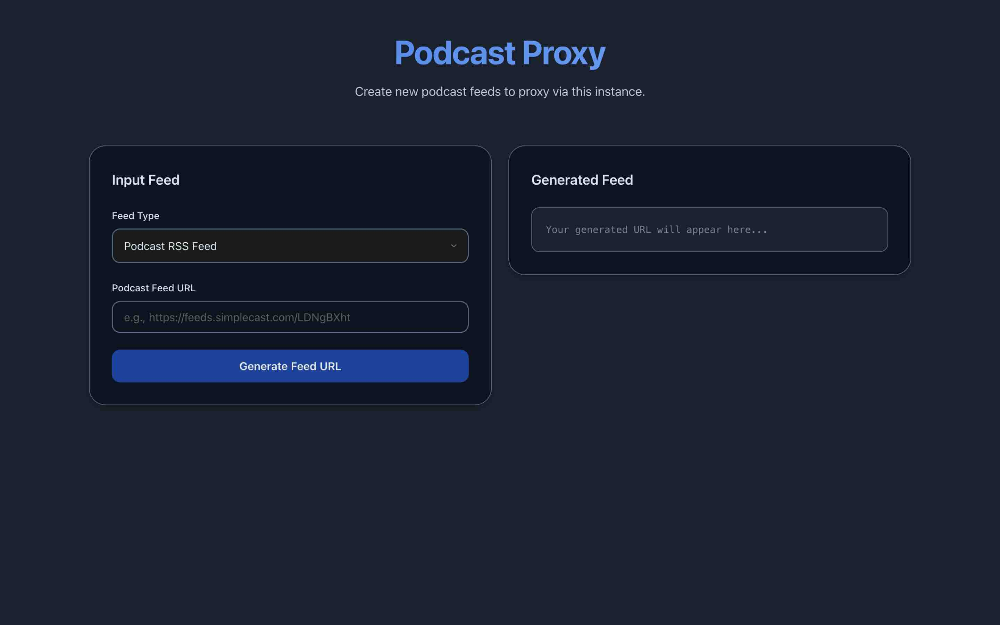

# podcast_proxy

A proxy server for streaming podcasts so dynamically-inserted geo-specific adverts are targeted at the proxy server and not the user. Combined with a VPN connected to other regions, adverts can be served in alternate languages or bypassed altogether.

The server can also turn YouTube channels into podcast feeds.

## Usage

### Hosting

```
version: '3.8'
services:
  webserver:
    image: ghcr.io/coayer/podcast_proxy:latest
    ports:
      - 80:80
    environment:
      EXTERNAL_PROXY: "http://localhost:8888"
```

#### Environment variables

`EXTERNAL_PROXY`: (Optional) Proxy streams through an additional HTTP proxy. For example, using [qdm12/gluetun](https://github.com/qdm12/gluetun) with the `HTTPPROXY` variable set, the podcast proxy server will stream podcasts through the gluetun container.

### Clients

The proxy rewrites podcast feeds so episode file URLs point to the proxy server.

Feed URLs can be generated using the web UI at the server's root page:



Podcast feed URLs can also be manually created:

#### RSS feeds

Proxied podcasts can be added to clients by placing the original podcast RSS URL (with protocol omitted) after the `/feed/` path of the proxy server.

For example, the podcast located at:

`https://feeds.simplecast.com/LDNgBXht` 

Should be added to the podcast client as:

`https://podcast-proxy.private/feed/feeds.simplecast.com/LDNgBXht`

The resulting RSS feed will prefix the original file URLs with `https://podcast-proxy.private/stream/` so clients download from the proxy server.

#### YouTube channels

YouTube channel podcast feeds can be created with the path `/youtube/CHANNEL_ID`

To get a channel ID: 

Go to the YouTube channel page → Click ...more → Share channel → Copy channel ID
